<h1 align="center">
  PnP PowerShell extension
</h1>

  

  

This extension will boost your productivity when creating scripts that use PnP PowerShell. Currently, the extension provides:

- embedded documentation
- samples powered by PnP Script Sample Gallery 
- snippets with all possible PnP PowerShell commands

Please check [PnP PowerShell docs](https://pnp.github.io/powershell/) for more information.

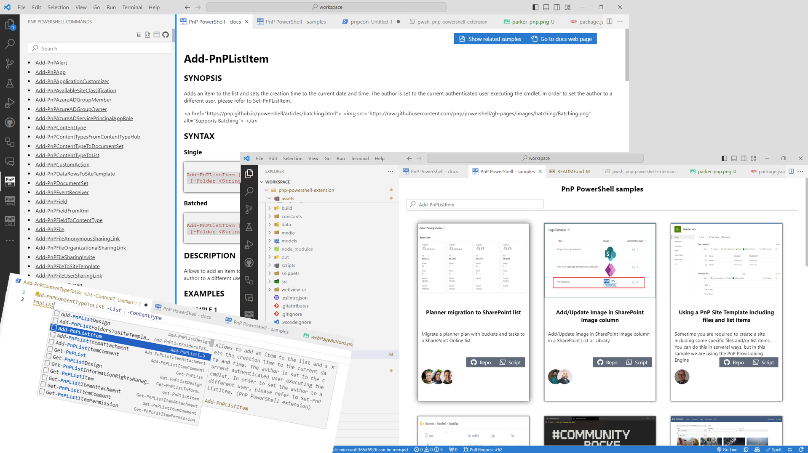

## ✨ Capabilities

### 1️⃣ Script samples gallery

Using `PnP PS: Open samples gallery` command, or the 'Samples' button from the controls above the command list, you may open the gallery with all available script samples. Currently, the samples shown are retrieved from the [PnP script samples repository](https://github.com/pnp/script-samples). From the samples gallery you may go to the sample location or create a new tab (file) in the editor prefilled with the PnP PowerShell script. It is possible to search for samples by:

- title
- authors
- commands used in samples

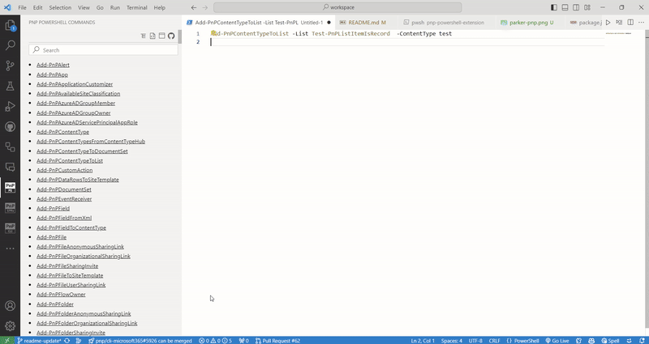

### 2️⃣ Docs

This functionality provides PnP PowerShell docs view for all commands inside VS Code. No more context switching between the code editor and browser. It is possible to go to docs original website location and also open the sample gallery showing all samples using that command.

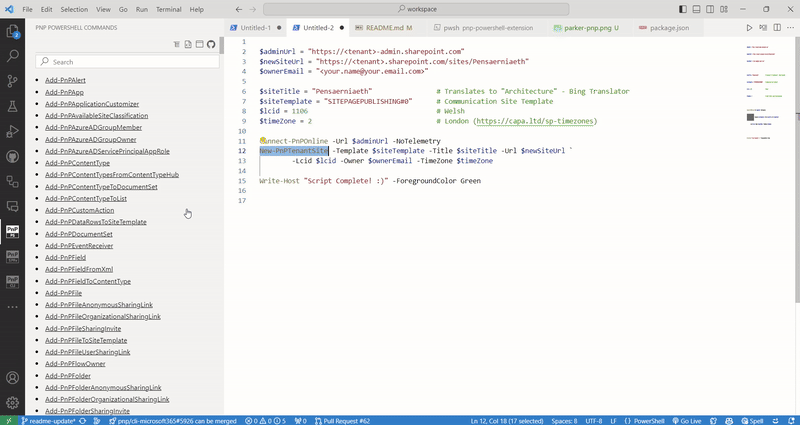

It is also possible to use the command `PnP PS: Open docs for command` to open the docs for a specific command.

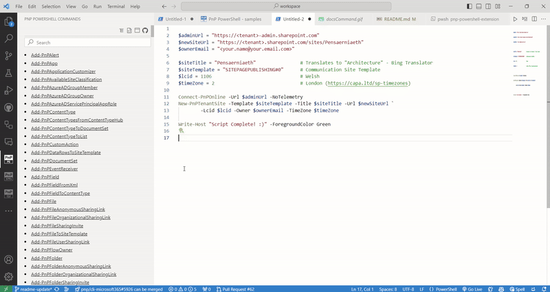

### 3️⃣ Command list tree view

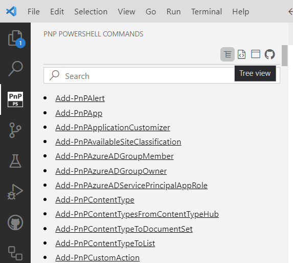

The command list also has the functionality to group commands view by command name verb

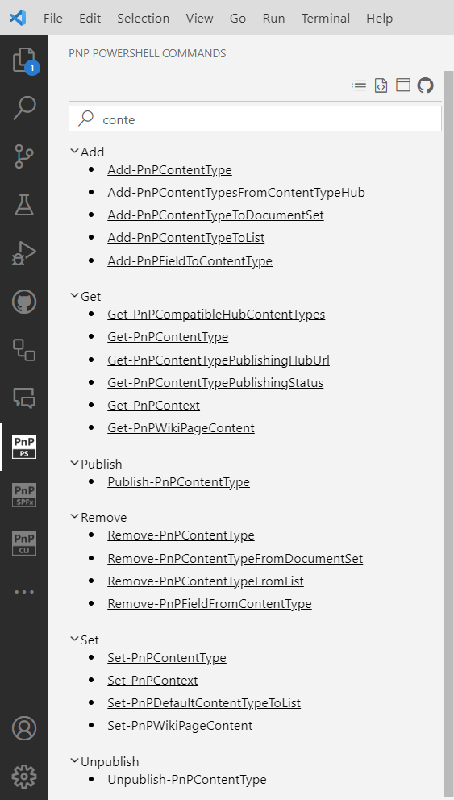

### 4️⃣ Snippets

The extensions help to quickly find the correct PnP PowerShell command and use it thanks to code snippets. The command is added along with all required parameters. It is possible to quickly move between parameters using 'Tab' key. Each snippet has a description which may be found in the docs which is a great help to quickly understand the commands functionality.

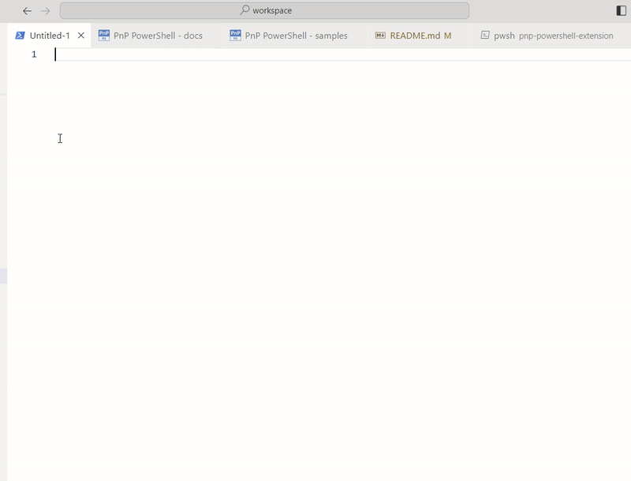

In order to use snippets please type part of a PnP PowerShell command and press enter or tab. The command will be automatically added to the code along with all required parameters. You may also use 'Ctrl + Space' (Windows, Linux) or 'Cmd + Space' (macOS) to activate snippets from within the editor.

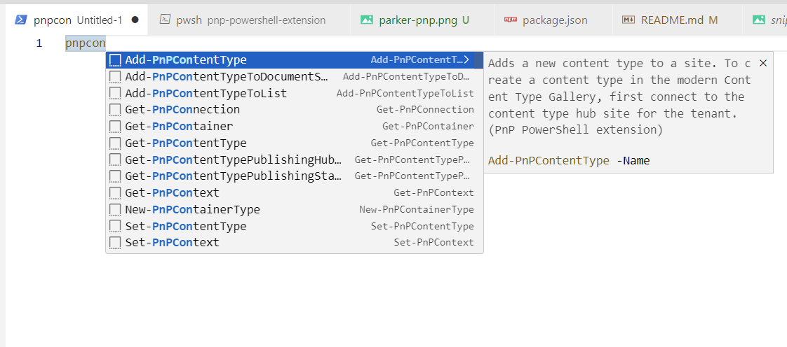

It is also possible to use the command `Insert Snippet` in VS Code to see the full list

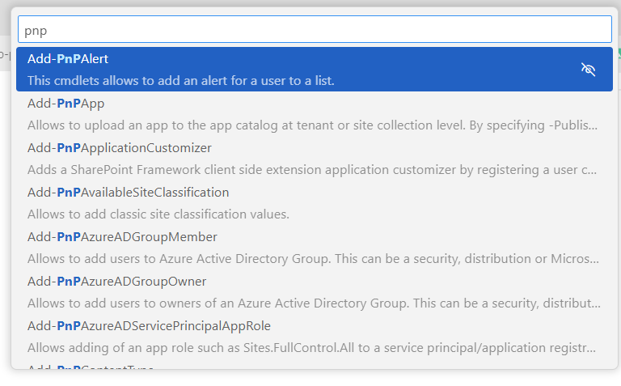

### 5️⃣ Transition to PnP PowerShell Docs website

The extension provides many ways to go to the PnP PowerShell Docs web page or GitHub repository.

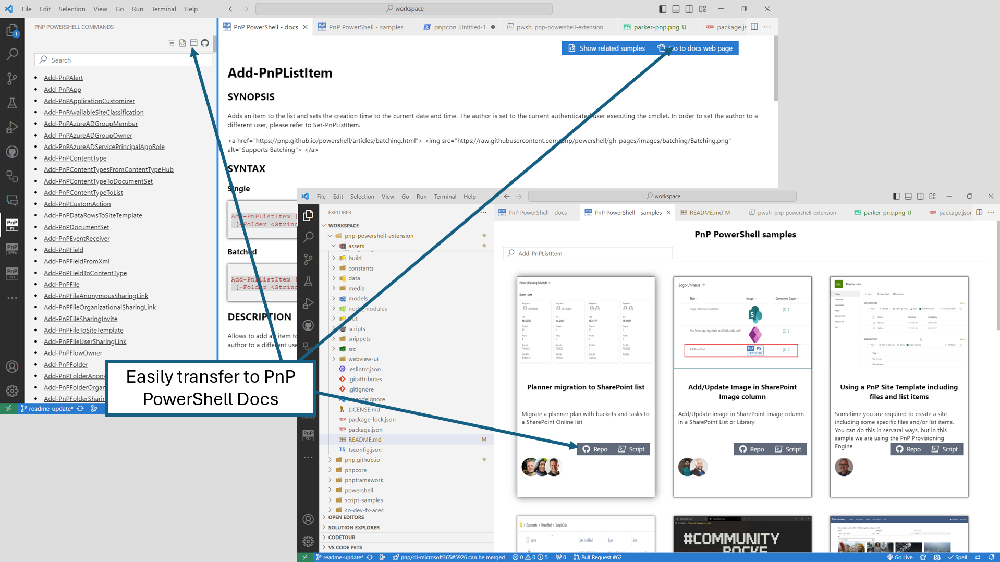

## 🤖 Commands

The extension provides the following commands:

| command   |      description      |
|----------|:-------------:|
| PnP PS: Open samples gallery | Opens up the sample gallery |
| PnP PS: Open docs for command | Search for a command doc file. The command may also be prefilled by the selected PnP PowerShell command   |

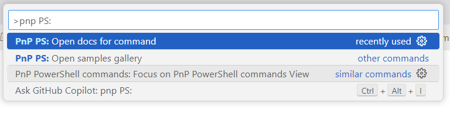

## 🙋 Support

This project is a community lead extension provided by the [Microsoft 365 and Power Platform Community](https://aka.ms/m365/community) members. Questions, problems, or feedback is more than welcome. Please create an issue in the extension repository [issue list](https://github.com/pnp/vscode-pnp-powershell/issues).

## 👍 Community

Are you building experiences for Microsoft 365? - Everyone is welcome to join our [Microsoft 365 and Power Platform Community](https://aka.ms/m365/community) efforts with community calls, samples and guidance. Join our [weekly community calls](https://aka.ms/m365/calls) for Microsoft 365 and Power Platform topics or engage with us on [Discord](https://aka.ms/community/discord). Everyone is welcome 🧡

## 🧾 Code of Conduct

This project has adopted the [Microsoft Open Source Code of Conduct](https://opensource.microsoft.com/codeofconduct/).
For more information, see the [Code of Conduct FAQ](https://opensource.microsoft.com/codeofconduct/faq/) or contact [opencode@microsoft.com](mailto:opencode@microsoft.com) with any additional questions or comments.

## 😍 "Sharing is Caring"

<h1 align="center">
  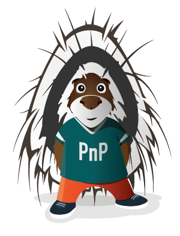
</h1>

## 🔑 License

[MIT License](https://github.com/pnp/vscode-pnp-powershell/blob/main/LICENSE.md)

## ⚠️ Disclaimer

**THIS CODE IS PROVIDED *AS IS* WITHOUT WARRANTY OF ANY KIND, EITHER EXPRESS OR IMPLIED, INCLUDING ANY IMPLIED WARRANTIES OF FITNESS FOR A PARTICULAR PURPOSE, MERCHANTABILITY, OR NON-INFRINGEMENT.**
